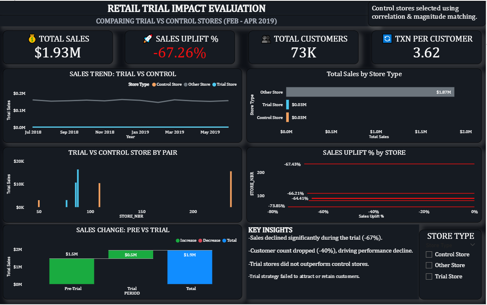
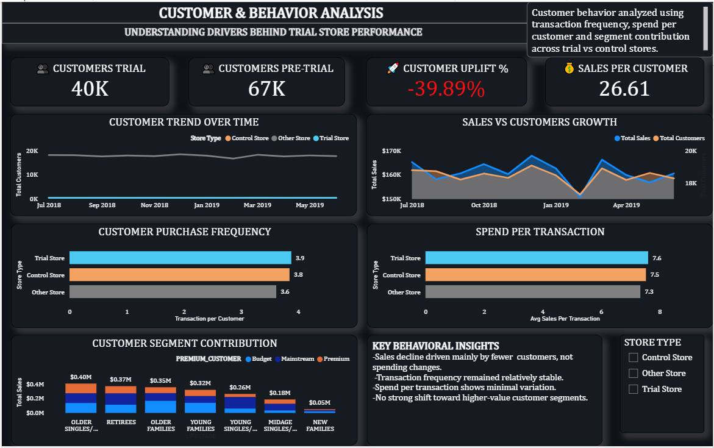

# Retail Trial Impact Analysis

## 📌 Project Overview

This project analyzes the performance of selected retail stores during a defined trial period to evaluate whether a business strategy led to measurable improvements in sales and customer behavior. The analysis compares trial stores against similar control stores to isolate the true impact of the trial and determine whether observed changes were driven by the strategy or by existing trends.

---

## 🎯 Business Problem

The objective of this analysis was to determine whether trial stores outperformed comparable control stores during the trial period (February–April 2019).

Key questions addressed:
- Did sales increase during the trial period?
- Was performance driven by customer growth or purchasing behavior?
- Did trial stores outperform control stores?
- What factors influenced the overall performance outcome?

---

## 🧪 Methodology

To ensure a fair and meaningful comparison, trial stores were evaluated against control stores with similar historical performance patterns. This approach helps reduce bias and allows for a more accurate assessment of the trial’s impact.

### Store Grouping:
- **Trial Stores:** 77, 86, 88  
- **Control Stores:** 50, 109, 237  

Each trial store was paired with a corresponding control store to enable direct comparison of performance.
This pairing enables a controlled comparison by isolating performance differences between similar stores.

The analysis was conducted by comparing key metrics across two periods:
- Pre-Trial Period (July 2018 – January 2019)
- Trial Period (February 2019 – April 2019)

Performance was evaluated using:
- Total Sales
- Total Customers
- Transactions per Customer
- Sales per Customer

This structure allows for both outcome analysis (what changed) and driver analysis (why it changed).

---

## 🛠️ Tools & Technologies

- Power BI (Dashboard Development & Data Visualization)
- Excel (Data Cleaning and Preparation)
- SQL (Data Structuring and Querying)

---

## 📊 Dashboards

### 🔹 Trial Impact Overview

### 🔹 Customer & Behavior Analysis

---

## 📈 Key Findings

The analysis revealed that the trial did not achieve its intended outcome. Sales declined significantly during the trial period, accompanied by a noticeable drop in customer count. Trial stores did not outperform their corresponding control stores, indicating that the observed performance was not driven by the trial strategy.

Further analysis showed that customer purchasing behavior, including transaction frequency and average spend per transaction, remained relatively stable. This suggests that the decline in sales was not due to reduced spending by existing customers, but rather a reduction in the number of customers visiting the stores.

---

## 🧠 Business Insights

The primary driver of the performance decline was reduced customer engagement rather than changes in customer behavior. While existing customers maintained consistent purchasing patterns, the trial strategy failed to attract or retain sufficient customer traffic to sustain or improve sales performance.

This highlights the importance of focusing not only on customer behavior optimization but also on customer acquisition and retention when implementing retail strategies.

---

## 🚀 Recommendations

- Re-evaluate the trial strategy to better target customer acquisition and retention
- Investigate potential external factors affecting store traffic during the trial period
- Implement targeted marketing efforts to attract high-value customer segments
- Continuously monitor both customer volume and behavior to ensure balanced performance improvement

---

## 📂 Data

A sample dataset is included in this repository due to file size limitations.

---

## 👤 Author

A. Jeremiah Martins  
Data Analyst | Power BI | SQL | Data Storytelling
